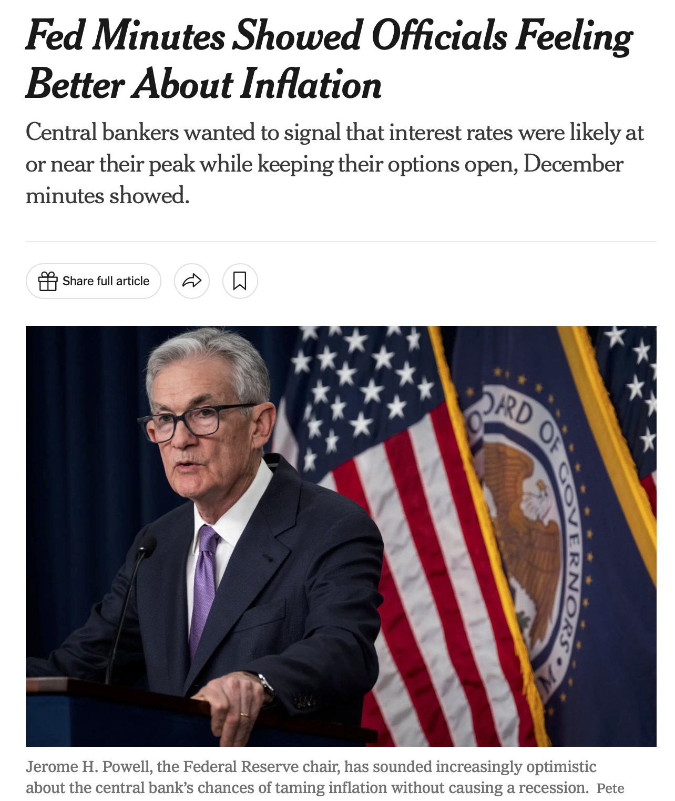
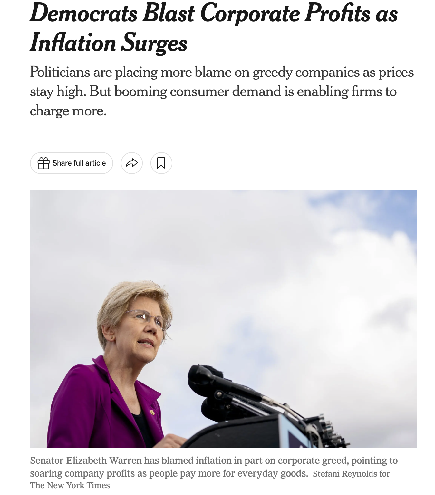
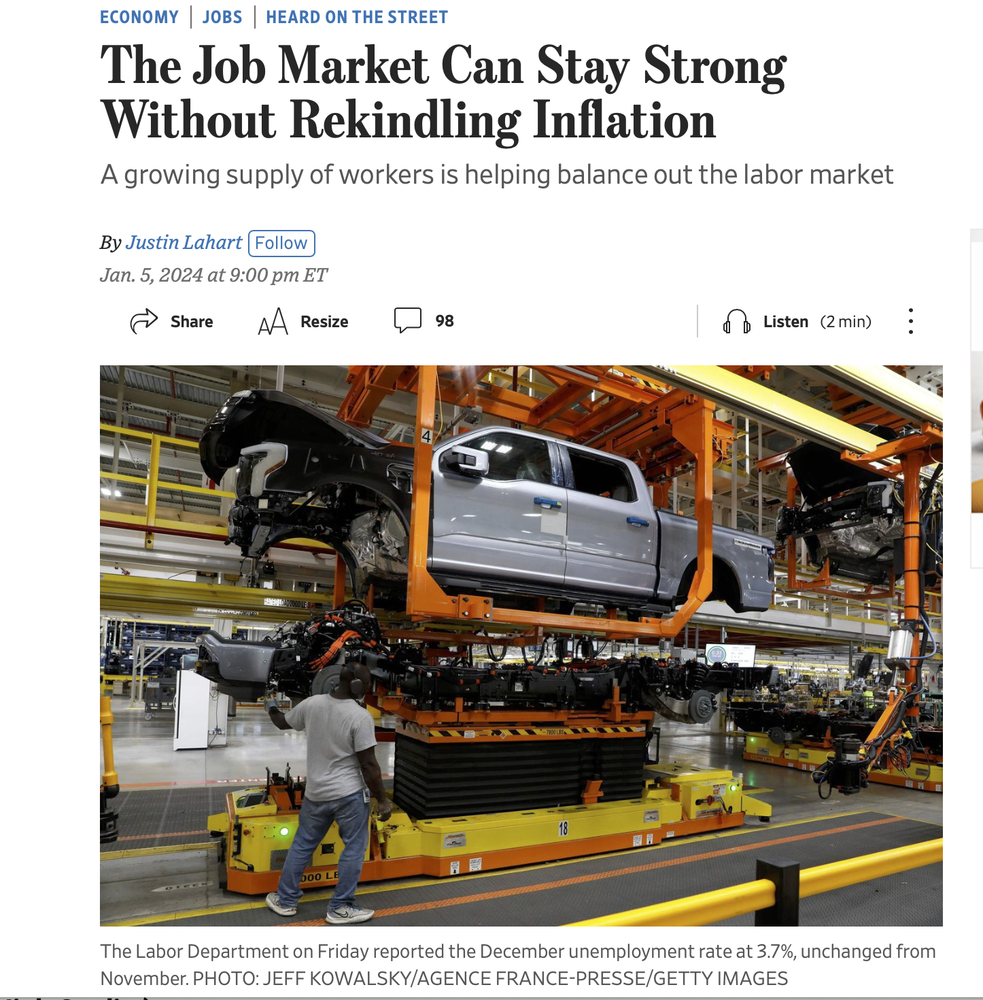

class: inverse, middle


```{r Setup, include = F}
options(htmltools.dir.version = FALSE)
library(pacman)
p_load(broom, latex2exp, ggplot2, ggthemes, ggforce, viridis, dplyr, magrittr, knitr, parallel, xaringanExtra, tidyverse, sjPlot, showtext, mathjaxr, ggforce, furrr, kableExtra, wooldridge, hrbrthemes, scales, ggeasy, patchwork)


# Knitr options
opts_chunk$set(
  comment = "#>",
  fig.align = "center",
  fig.height = 7,
  fig.width = 10.5,
  warning = F,
  message = F,
  dpi=300
)

theme_set(theme_ipsum_rc())

```


layout: false
class: inverse, middle

# Motivation


---

# Housekeeping

<br><br>

.b[Required reading]:

  - [`OpenStax, ch.1`](https://openstax.org/books/principles-macroeconomics-3e/pages/1-introduction)
  
    - Introduction, and Sections 1.1&mdash;1.2.

---

# Motivation

Before we dive deep into Macroeconomics, we first need to define some basic Economics .hi-orange[vocabulary].

<br>

--

First and foremost:

> *The answer is always ".hi[it depends]."*

--

<br>

- Why so?

--

  - As in any .hi-orange[Social Science], the issues studied in Economics hold strong ties to .hi[different] *individuals*, different *locations*, different *social classes*, and different *historical periods*.
  
--

  - As an example, the *working class* in the US was one in the 1960s, and it is very different in 2024.
  
---

layout: false
class: inverse, middle

# The definition of Economics

---

# The definition of Economics

> "Economics is the study of how goods and services are distributed."

--

<br>

> "Economics is the study of individuals' unlimited wants in a world of limited resources."

--

<br>


> "Economics is the study of how individuals behave and spend their income."

--

<br>

> "Economics analyzes the choices made by society, and how present and past choices are reflected in future outcomes"

--

<br>

- Which one is correct?


---

# The definition of Economics


<br>

Regardless of the definition you pick, the .hi[most important factor] is that studying Economics provides a .hi-orange[set of tools] to *critically* analyze social problems in its quantitative and qualitative economic aspects.

--

<br>

Just as a first exercise, consider the following:

  - 50 years ago, a basket of groceries (some eggs, milk, chicken, and butter) used to cost about $2.
  - Today, this same basket may cost about $20.
  
--

<br>

Have things become .hi[more expensive] over this time period?

---

layout: false
class: inverse, middle

# Economic reasoning

---

# Economic reasoning

Economic reasoning involves comparing .hi[costs and benefits].

--

And, many times, costs and benefits go beyond *money* or other *quantitative measures*.

--

<br>

  - Examples?
  
--

<br>

Also, economic reasoning requires knowledge of .hi-orange[institutions].

--

  - .hi[Institutions] are entities that affect economic decisions and outcomes.
  
--

    - Families (households), social networks, markets, governments,...

---

layout: false
class: inverse, middle

# Economic policy

---

# Economic policy

.hi[Economic policies] are measures taken by the government (and its agencies) in order to *influence economic outcomes*.

--

<br>

- For instance, a government may intervene if the *price* of a good or service is too abusive.

--

- Furthermore, if the economy looks overstimulated, the government may choose to *increase interest rates* to contain demand.

--

- Also, the government may adopt a *higher income tax* on wealthy individuals, to provide a more egalitarian distribution of income.

---


# Economic policy

.center[

]


---


# Economic policy


.center[

]

---


# Economic policy

.center[

]


---

layout: false
class: inverse, middle

# Micro *vs.* Macro

---

# Micro *vs.* Macro

Economic reasoning and knowledge can be applied in several .b[different] areas.

--

In Economics, the basic .b[scope] distinction lies on .hi-orange[Micro] and .hi[Macro]economics.

--

<br>

While .hi-orange[Micro]*economics* applies economic reasoning by studying .b[individual] choices and behavior, .hi[Macro]*economics* considers the economy .b[as a whole], breaking it down into its main *aggregate components*.

--

<br>

.hi-orange[Micro]*economics* concentrate on topics like

  - Individuals'/families' decisions on *what to buy*;
  - How one uses their time between *labor and leisure*;
  - How businesses *price* their goods and services, etc.

---

# Micro *vs.* Macro

On the other hand, .hi[Macro]*economics* studies aggregate problems such as

  - *Inflation*;
  - *Unemployment*;
  - Economic *growth*;
  - How government *policies* affect all of the above and other areas, such as the environment;
  - ... and many more.


--

<br>

Thus, although very different in .hi[scope], Micro and Macroeconomics are closely related.

--


  - Several microeconomic facts/actions may lead to important macroeconomic changes.
  
  - Also, macroeconomic conditions affect individual-level decisions every day.
  
---

layout: false
class: inverse, middle

# Mini Project 1


---

# Mini Project 1

<br><br>

This discussion leads us to .hi[Mini Project 1]:

  - where you will explore the .hi-orange[relationship] between *macro* and *microeconomic* events.

---

layout: false
class: inverse, middle

# Next time: The macroeconomic perspective


---
exclude: true

