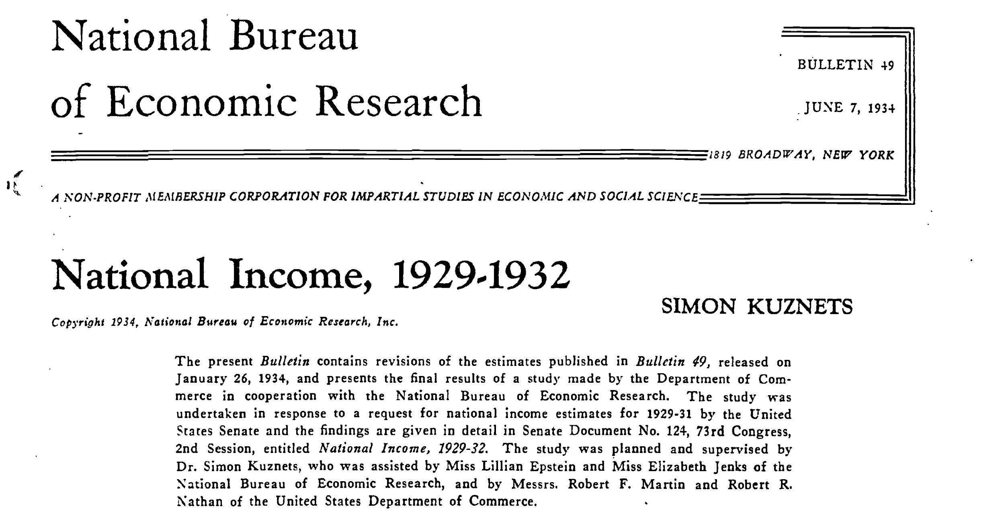
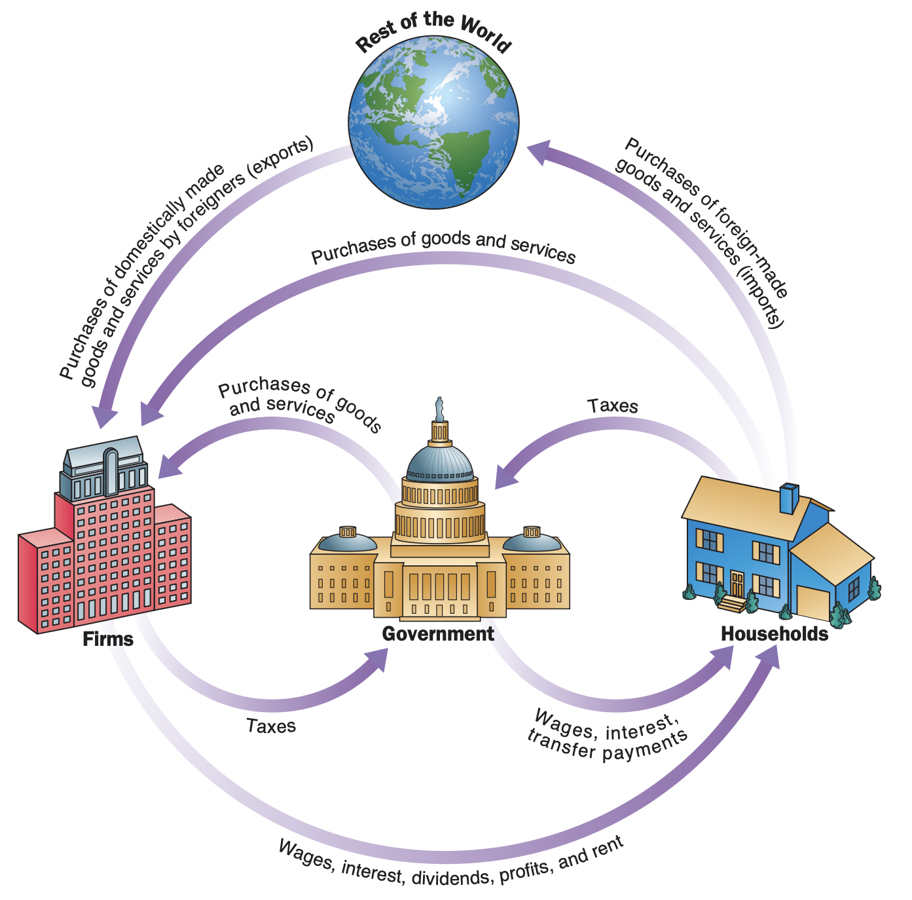

class: inverse, middle

```{r Setup, include = F}
options(htmltools.dir.version = FALSE)
library(pacman)
p_load(broom, latex2exp, ggplot2, ggthemes, ggforce, viridis, dplyr, magrittr, knitr, parallel, xaringanExtra, tidyverse, sjPlot, showtext, mathjaxr, ggforce, furrr, kableExtra, wooldridge, hrbrthemes, scales, ggeasy, patchwork)


# Knitr options
opts_chunk$set(
  comment = "#>",
  fig.align = "center",
  fig.height = 7,
  fig.width = 10.5,
  warning = F,
  message = F,
  dpi=300
)

theme_set(theme_ipsum_rc())

```


# Motivation


---

# Housekeeping

 .b[Required readings]:
 
 <br>

  * [`CORE, ch. 13`](https://www.core-econ.org/the-economy/book/text/13.html)
  
      * Sections `13.3` & `13.4`


  * [`OpenStax, ch. 6`](https://openstax.org/books/principles-macroeconomics-3e/pages/6-introduction-to-the-macroeconomic-perspective).


<br>

.b[Required listening]:

  * [`Planet Money podcast: GDP and what counts`](https://www.npr.org/2022/07/20/1112482124/planet-money-summer-school-2-gdp-what-counts)

---

# Last time

<br>

After a brief introduction to some basic .hi[economic] concepts, we focus on what this course is about.

--

In case one is interested in the economic functioning of the entire system, it requires studying .hi[Macroeconomics].

--

  - Macroeconomics focuses on the .hi-orange[determinants] of total *national* output (i.e., its *goods* and *services*).


--

<br>

Thus we .hi[do not] focus on a single *household's* income, but *national* income; not individual prices, but the *whole economy's* price level, and so on.


---
layout: false
class: inverse, middle

# The size of the economy


---

# The size of the economy

Economists use .hi-orange[aggregate statistics] to describe macroeconomic phenomena.

  - Here, *aggregate* simply means .hi[sum].


--

<br>

Among these, the .hi[Gross Domestic Product] (GDP) is the .hi-orange[leading] measure of a country's overall economic *performance* and *size.*

--

  * It is defined as the sum (in money value) of all .hi-orange[final] goods and services produced in an economy in a given period. As described by the economist [`Diane Coyle`](https://en.wikipedia.org/wiki/Diane_Coyle):


> .small[*"Everything from nails to toothbrushes, tractors, shoes, haircuts, management consultancy, street cleaning, yoga teaching, plates, bandages, books, and the millions of other services and products in the economy."*]


---

# The size of the economy


<br><br><br>

[`What is the "size" of the US economy?`](https://fred.stlouisfed.org/series/GDP)


---

# The size of the economy

.center[

]


---

# The size of the economy


Notice that GDP only accounts for .b[final] .hi[goods] and .hi-orange[services].

  - *What does this mean?*
  
--

Many goods are produced by one firm and further used in production as an .hi-orange[input] by another firm.

--

Also, the same idea can be applied to .hi[used goods].

--

<br>

This is done to avoid .hi[double counting].


--

<br>

This [`short document by the BEA`](https://www.bea.gov/system/files/2019-10/Classroom-Stu-Intermediate%20Inputs.Final_.pdf) may help you in getting a better idea on final/intermediate goods.

---

layout: false
class: inverse, middle

# Limitations of GDP

---

# Limitations of GDP

As we have seen so far, GDP attempts at measuring .hi[economic activity] through a .hi-orange[single number].

--

<br>

Recall, from our previous lecture, the definition of economic .hi[institutions]:

  > Entities that affect economic *decisions* and *outcomes*.
  

--

<br>

That said, do you think that:

  1. Every economic outcome is necessarily *measurable*?
  
  2. *Every* institution is accounted for in GDP?
  
---

layout: false
class: inverse, middle

# Why bother?

---

# Why bother?

Now that we are more informed about what GDP is and some of its limitations, why should we give it so much .hi-orange[value]?

--

<br>

A few reasons:

  - .hi[Compare] different periods, different countries, different regions;
  
  - Important piece of data for .hi-orange[institutional] work;
  
  - .hi[Microeconomic] decisions.

---
layout: false
class: inverse, middle

# The components of the macroeconomy

---

# The components of the macroeconomy

<br><br>

From an aggregate perspective, the .hi[participants] of an economy can be grouped in 4:

  1. *Households*;
  2. *Firms*;
  3. The *government*;
  4. The *rest of the world*.
  
--

<br>

Households and firms form the .hi-orange[private sector], while the government is the .hi[public sector], and the rest of the world is the .hi-orange[foreign sector].


---

# The components of the macroeconomy

.smaller[The economic interactions involving these 4 groups can be summarized through the .hi[circular flow diagram]:].footnote[.smaller[Picture taken from Case, Fair, and Oster (2012).]]

.center[

]

---

# The components of the macroeconomy

<br><br>

If we analyze GDP from the perspective of .hi[spending], it can be broken down into the following components:

<br>

* .hi[*Consumption*] of goods and services;

* Private .hi[*investment*];

* .hi[*Government*] expenditures;

* .hi[*Net exports*] (*Exports* - *Imports*).


---

# The components of the macroeconomy

<br>

.hi[Consumption] accounts for all household consumption expenditures on final goods and services.

  - Household appliances, haircuts, concert tickets, groceries,...

--


<br>

It usually accounts for about 2/3 of total GDP.

--

<br>

[`US aggregate consumption data`](https://fred.stlouisfed.org/series/PCE)

---

# The components of the macroeconomy

<br>

Aggregate .hi[investment] accounts for businesses purchasing new machinery, new software, new plants, as well as household residential investment.

  - It also includes changes in *inventories*, which is unsold output produced in the reference year.
  

--

<br>

[`US aggregate private investment data`](https://fred.stlouisfed.org/series/GPDI)


---

# The components of the macroeconomy

<br>

.hi[Government] expenditures account for federal, state, and local instances consumption and investment decisions.

  - Building highways, new schools, military spending, health & education,...

  - Unemployment and veteran benefits, social security payments are .hi[not] included. These are transfers that will likely be spent on *consumption.*
  
--

<br>

[`US aggregate government expenditures data`](https://fred.stlouisfed.org/series/FGEXPND)

---

# The components of the macroeconomy

<br>

.hi[Net exports] is the difference between .hi-orange[exports]&mdash;domestically produced goods that a country sells abroad&mdash;and .hi-orange[imports]&mdash;goods and services produced in other countries that residents of another country purchase. 


  * We call the gap between exports and imports the .hi[trade balance]. If a country’s exports are larger than its imports, then a country has a .hi-orange[trade surplus]; if imports exceed exports, we have a .hi[trade deficit].

--

<br>

[`US net exports data`](https://fred.stlouisfed.org/series/NETEXP)

---

# The components of the macroeconomy

We can now write down the GDP measurement as:

<br>

$$
\begin{aligned}
\text{GDP} \ = \text{Consumption + Investment + Government Spending + Net exports}
\end{aligned}
$$

<br>

$$
\begin{aligned}
\text{GDP} = C + I + G + (X - M)
\end{aligned}
$$

---

# The components of the macroeconomy

<br><br>


Reality check...

<br>

> [`NIPA tables by the Bureau of Economic Analysis (BEA)`](https://apps.bea.gov/iTable/?reqid=19&step=3&isuri=1&1921=survey&1903=13#eyJhcHBpZCI6MTksInN0ZXBzIjpbMSwyLDNdLCJkYXRhIjpbWyJOSVBBX1RhYmxlX0xpc3QiLCI1Il0sWyJDYXRlZ29yaWVzIiwiU3VydmV5Il1dfQ==)


---

 
# An application

Suppose you are given the following data (in US$ billions):

  - *Sales of durable goods*: $ 1,035
  - *Nonresidential investment expenditures*: $ 1,388.80
  - *Federal Government expenditures*: $ 1,144.80
  - *Changes in business inventories*: $ -120.90
  - *Exports*: $ 1,564.20
  - *Services*: $ 6,833.90
  - *Sales of nondurable goods*: $ 2,220.20
  - *State and local government spending*: $ 1,786.90
  - *Imports*: $ 1,956.60
  - *Residential investment*: $ 361.00
  
  
--

Compute *(a)* each GDP .hi[component] and *(b)* its .hi-orange[total value].

---
layout: false
class: inverse, middle

# Next time: GDP shapes and forms

---
exclude: true