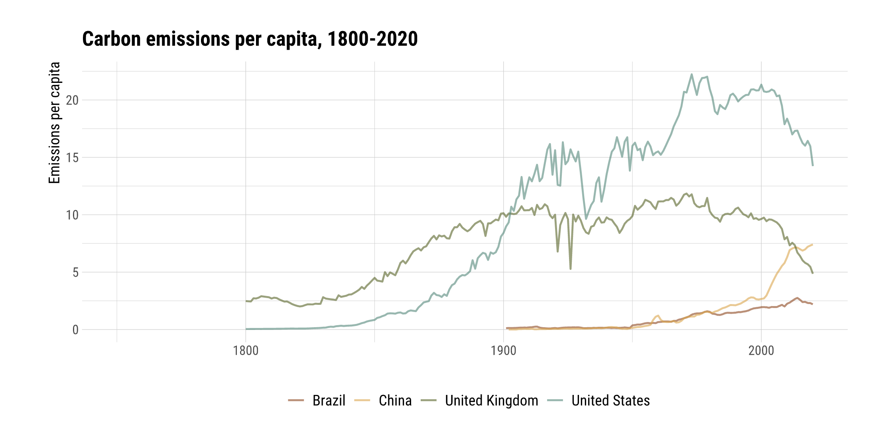
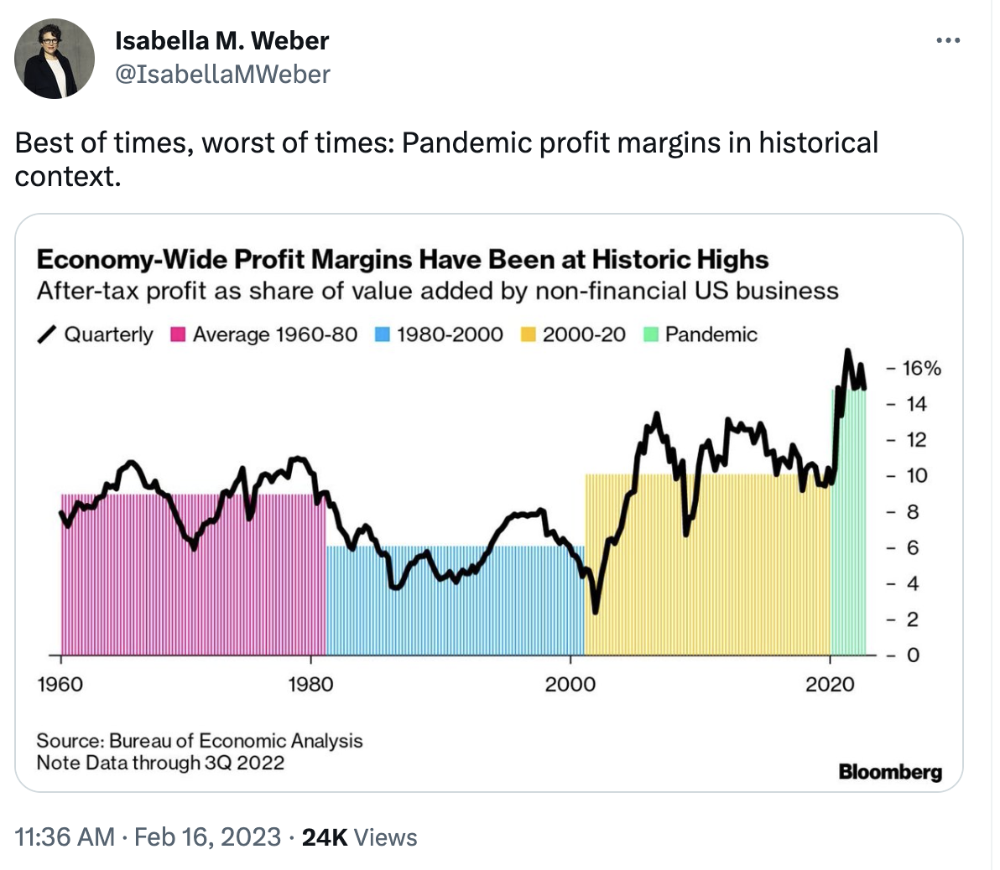

class: inverse, middle

```{r Setup, include = F}
options(htmltools.dir.version = FALSE)
library(pacman)
p_load(broom, latex2exp, ggplot2, ggthemes, ggforce, viridis, dplyr, magrittr, knitr, parallel, xaringanExtra, tidyverse, sjPlot, showtext, mathjaxr, ggforce, furrr, kableExtra, wooldridge, hrbrthemes, scales, ggeasy, patchwork)


# Knitr options
opts_chunk$set(
  comment = "#>",
  fig.align = "center",
  fig.height = 7,
  fig.width = 10.5,
  warning = F,
  message = F,
  dpi=300
)

theme_set(theme_ipsum_rc())

```


# Motivation


---

# Housekeeping

.b[Required readings]:
 
 <br>

  * [`OpenStax, ch. 7`](https://openstax.org/books/principles-macroeconomics-3e/pages/7-introduction-to-economic-growth)
  

<br>


.b[Required listening]:
 
 <br> 
  
  * [`FRED's Economic Lowdown podcast series: Economic growth`](https://www.stlouisfed.org/education/economic-lowdown-podcast-series/episode-15-economic-growth)
  
  * [`Planet Money podcast: Productivity & Getting Lit`](https://www.npr.org/2022/08/31/1120364348/planet-money-summer-school-8-productivity-getting-lit)
  
---

# A long-run perspective

.hi[Business cycles] reflect the *short-run* behavior of economic growth.

--

When turning our attention to *long-run* periods, we approach growth as a .hi-orange[secular] (and usually *upward*) trend.

--

<br>

Over time, economies tend to produce .hi[more] goods and services from their *existing* production processes and resources.


--

<br>

[`World Real GDP over time`](https://data.worldbank.org/indicator/NY.GDP.MKTP.KD)

---

# A long-run perspective

A useful concept when studying growth is .hi[potential] output (i.e., potential GDP).

--

> An economy's .hi-orange[potential output] is the *highest* amount of output it can produce from its existing productive and natural capacities.

--

<br>

Potential output is, then, a .hi[barrier] beyond which an economy cannot expand without either *increasing available factors of production*
or *increasing productivity*.

--

<br>

[`Data on US potential GDP`](https://fred.stlouisfed.org/series/GDPPOT)

---

layout: false
class: inverse, middle

# How growth happens

---

# How growth happens

Recalling:

  - A nation's potential output .hi[cannot] increase without it either using more *factors of production* and/or *increasing its productivity*.
  
--

<br>

What are .hi-orange[factors of production]?

  - *Land*;
  - *Labor*;
  - *Capital* (human and physical);
  - *Energy.*
  
---

# How growth happens

One major .hi[issue] with an economy (indefinitely) utilizing more factors of production is there is a .hi-orange[limit] to their use.

--

<br>

Given that, existing factors need to be made .hi[more productive].
  
  
  
--

<br>

In other words, an economy needs to generate .hi-orange[more] output with either the *same* or *less* input use.

---

# How growth happens

Economic growth is more sustainable when there are conditions for .hi[labor productivity] to increase.

--

[`Adam Smith`](https://en.wikipedia.org/wiki/Adam_Smith) (1723&mdash;1790) recognized early on that an economy organized through .hi-orange[markets] could allow for:

  1. Workers' .hi[specialization] (with individuals dedicated to certain aspects/stages of production);
  
  2. .hi-orange[Division of labor] (splitting the production processes into smaller tasks).
  
--

<br>

In a *market economy*, the several different markets are .hi[interdependent], which allows individuals to take advantage of the aspects above and trade for all their needs.

--

<br>

As a consequence, the economy's .hi-orange[productivity] and .hi[standards of living] tend to increase.


---

layout: false
class: inverse, middle

# Growth in numbers


---

# Growth in numbers

.smaller[Starting from:]

```{r, echo = FALSE, message = FALSE, dev = "svg", fig.height = 7}

library(tidyquant)
library(scales)


gdp <- tq_get("GDPC1", get = "economic.data", from = "1949-01-01")

gdp <- gdp %>% 
  select(date, price) %>% 
  rename(real_gdp = price)


p <- gdp %>% 
  ggplot(aes(x = date, y = real_gdp)) +
  geom_line(size = 0.6) +
  scale_x_date(breaks = breaks_width("10 years"),
               labels = label_date("%Y")) +
  scale_y_continuous(labels = dollar_format()) +
  labs(x = "", y = "Real GDP (2012 US$ Billions)",
       title = "Real GDP, United States",
       subtitle = "1949Q1–2022Q4",
       caption = "Source: US Bureau of Economic Analysis.") +
  easy_all_text_size(15)

p


```

---

# Growth in numbers

.pull-left[
```{r, echo = FALSE, message = FALSE, dev = "svg", fig.asp = 0.9}

p +
  easy_all_text_size(20)


```
]

.pull-right[

Looking at this measure in .hi[levels] shows the overall long-run process of economic growth.

But if we would like to know what was the .hi-orange[growth rate] over time, we need to compute these rates from the data in levels.

.smaller[
$$
\begin{aligned}
\text{Growth rate (%)} = \dfrac{\text{Final Period - Initial Period}}{\text{Initial Period}} \ \times 100
\end{aligned}
$$
]]

---

# Growth in numbers

.smaller[Then, from the first chart, we can calculate the .hi-orange[quarter-to-quarter growth rate] in GDP per capita:]

```{r, echo = FALSE, message = FALSE, dev = "svg", fig.height = 7}

gdp %>% 
  mutate( gdp_growth = ( ( real_gdp - lag(real_gdp, n = 1) ) / lag(real_gdp, n = 1) ) * 100 )  %>% 
  ggplot(aes(x = date, y = gdp_growth)) +
  geom_line(size = 0.6) +
  geom_hline(yintercept = 0, color = "darkred") +
  scale_x_date(breaks = breaks_width("10 years"),
               labels = label_date("%Y")) +
  scale_y_continuous(labels = percent_format(scale = 1)) +
  labs(x = "", y = "",
       title = "Real GDP growth, United States",
       subtitle = "1949Q1–2022Q4",
       caption = "Source: US Bureau of Economic Analysis.") +
  easy_all_text_size(15)

```

---

# Growth in numbers

<br><br><br>

Let us .hi[practice] this procedure using some real GDP annual data.

---
layout: false
class: inverse, middle

# Is growth good?


---

# Is growth good?

The general view among economists is that growth .hi[increases] our incomes, and thus .hi[improves] our standards of living.

--

<br>

This statement is different from the idea of supporting .hi-orange[unlimited growth].

--

<br>

Applying .b[economic reasoning] to this issue, there are several .hi[costs] associated with economic growth regimes.


---

# Is growth good?

.center[

]


---

# Is growth good?

.center[

]


---
layout: false
class: inverse, middle

# Next time: Unemployment

---
exclude: true