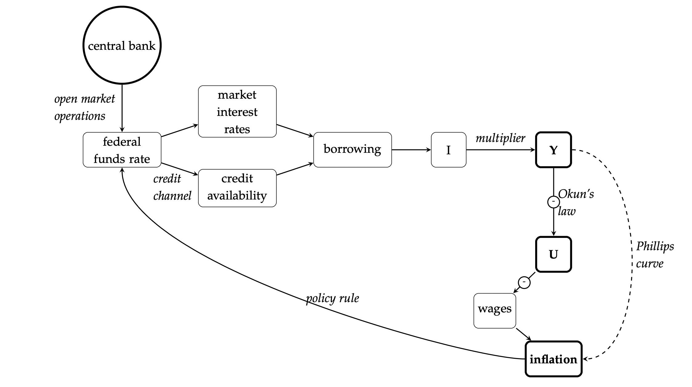
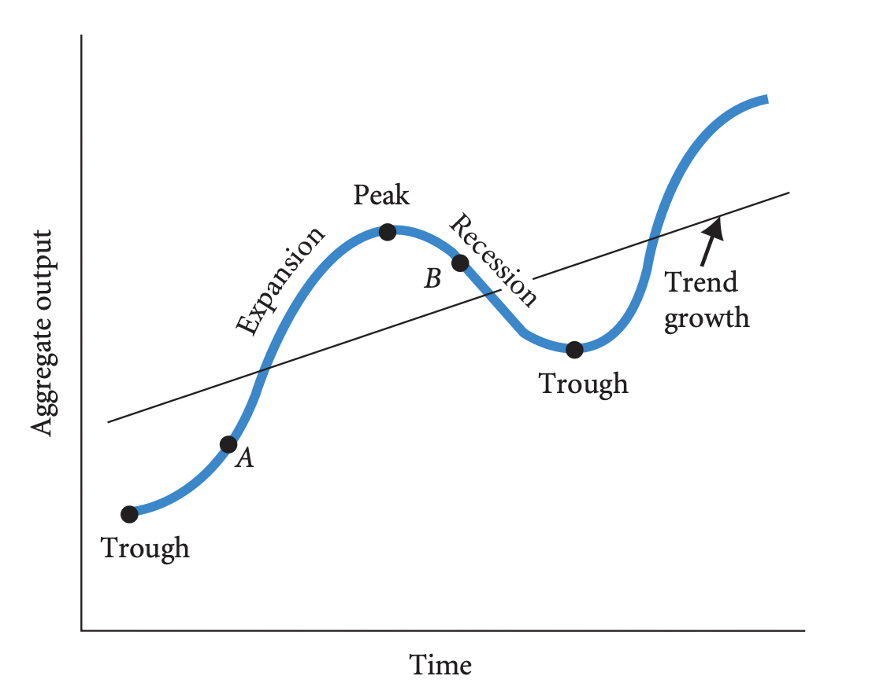

class: inverse, middle

```{r Setup, include = F}
options(htmltools.dir.version = FALSE)
library(pacman)
p_load(broom, latex2exp, ggplot2, ggthemes, ggforce, viridis, dplyr, magrittr, knitr, parallel, xaringanExtra, tidyverse, sjPlot, showtext, mathjaxr, ggforce, furrr, kableExtra, wooldridge, hrbrthemes, scales, ggeasy, patchwork)


# Knitr options
opts_chunk$set(
  comment = "#>",
  fig.align = "center",
  fig.height = 7,
  fig.width = 10.5,
  warning = F,
  message = F,
  dpi=300
)

theme_set(theme_ipsum_rc())

```


# Motivation


---

# Housekeeping

<br>

.b[Required readings]:

  - [`Board of Governors of the Federal Reserve System`](https://www.federalreserve.gov/monetarypolicy/fomc.htm)

  - [`FAQs About Treasury Marketable Securities`](https://treasurydirect.gov/help-center/marketable-faqs/)
  
<br>

.b[Required listening]:

  - [`Monetary Policy - The Economic Lowdown Podcast Series`](https://www.stlouisfed.org/education/economic-lowdown-podcast-series/episode-20-monetary-policy)
  
  - [`Planet Money podcast: The Fed & Volcker's Socks`](https://www.npr.org/2022/08/24/1119331894/planet-money-summer-school-7-the-fed-volckers-socks)

---

layout: false
class: inverse, middle

# Central banks & inflation

---

# Central banks & inflation

.hi[Central Banks] play a crucial role during an inflationary period.

--

  - But .hi-orange[why] is that so?

--

<br>

So far, we have studied .hi[how] aggregate output (GDP), unemployment, and inflation are *computed.*

--

In addition, we have seen how these variables are .hi-orange[intertwined]:

  - *Okun's law*;
  - The *Phillips curve*.
  
--


Now, it is time to see what .hi[policy instruments] can bring .hi-orange[stability] to these relationships.

  - More specifically, we will connect this issue with what is going on .hi-orange[today].

---

# Central banks & inflation

.center[



]


.smallest[.left[By [`JW Mason`](http://jwmason.org/)]]


---

# Central banks & inflation


Over the past four decades, governments have delegated to .hi[Central Banks] the role of *addressing macroeconomic (in)stability*.

--

In other words, Central Banks would act to make .hi[business cycles] *smoother.*


--


Recall:


.center[

]


---

# Central banks & inflation


Depending on the .hi-orange[state] of the economy, aggregate spending (mostly via aggregate *consumption* and *business investment*) will either over or underwhelm the economy's productive capacity.

--

When the economy is .hi-orange[overheated], individuals try to buy *beyond* what producers can make available.

  - .hi[Aggregate demand] can put pressure on the price level.
  
--

Conversely, when there is excess .hi[supply] of goods and services, more people tend to be unemployed and the price level tends to fall.

--

<br>

In both scenarios, .hi[central banks] are the those in charge of adjusting .hi-orange[observed GDP] to its .hi[potential] level.


---

# Central banks & inflation

There are .hi-orange[several] ways in which central banks can act as to either .hi[encourage] consumers and firms to spend more, or to .hi-orange[cool down] aggregate demand.

--

This way, central banks basically employ .hi[countercyclical] policies to manage the economy.

--

> .hi[Countercyclical] policies are measures that aim to either *boost* aggregate demand in recession periods, or *hit the brakes* on demand when the economy is overheated.

--

<br>

Economic policies conducted by central banks fall under the category of .hi[monetary policy].

--

> .hi[Monetary policy] involves influencing the economy through changes in the banking system's *reserves*, thus affecting the *supply of money* and the availability of *credit.*

--

  - The .hi[main] monetary policy tool is controlling .hi-orange[interest rates].


---

layout: false
class: inverse, middle

# Monetary policy


---

# Monetary policy

.hi[How much] money, .hi[how easy] to obtain money, and .hi[how costly] it is to have money in hand are crucial factors in a money- and credit-based economy.

--

Beyond other issues, monetary policy addresses these three problems through .hi-orange[controlling interest rates].

--

  - .mono[How much money?] Money supply;
  
  - .mono[How easy to obtain money?] Controlling credit access;
  
  - .mono[How costly to have money in hand?] Controlling interest rates.
  
--

These three categories go hand-in-hand via the .hi-orange[interest rate].

--

> In .hi[macroeconomic] terms, .hi[interest rates] are the *price of credit*. In addition, interest rates can be thought of as the price of *current* money in terms of *future* money.


---

# Monetary policy

Central banks usually .hi[do not] have .hi-orange[power] over private banking institutions regarding what interest rates these will charge.

--

Instead, what central banks .hi-orange[can do] is creating .hi[incentives] for these banks to to either *rise* or *lower* their rates, depending on the state of the economy.

<br>

--

In the case of the US economy, the interest rate that the US Federal Reserve (FED) controls is the .hi[federal funds rate].

<br>

> The .hi[federal funds rate] is the interest rate large banks charge each other for *short-term* (usually overnight) reserve loans.


---

# Monetary policy

<br><br>

Central banks may change their *policy rate* (i.e., the interest rate) through:

<br>

  1. .hi[Open market] operations;
  
  2. Using the .hi-orange[discount window];
  
  3. Paying .hi[interest on reserves].


---

# Monetary policy

<br><br>

Board time.

---

# Monetary policy

<br><br>

.hi[Open market operations] involve the central bank buying (selling) government treasuries, thus increasing (decreasing) the amount of reserves banks have to borrow.

--

<br>

Changes in the interest rate through the so-called .hi-orange[discount window] work in a similar way, but involve loans made directly by the central bank to other banks.

--

<br>

Lastly, the central bank may also pay .hi[interest on banks' reserves].

---

# Monetary policy

Even though the .hi-orange[terminology] may be confusing, the federal funds rate is the .hi[only] rate the central bank can actually decide on.

--

However, there are .hi[several different] interest rates practiced in financial markets.

  - 1-year government bonds;
  - 10-year government bonds;
  - 30-year mortgage...


<br>

--

Usually, these other interest rates will be equal to the policy (federal funds) rate, plus a .hi-orange[spread].


---

# Monetary policy

Another way of applying monetary policy is, instead of changing interest rates, act in the economy through the .hi[credit channel].

--

> The .hi[credit channel] affects the *availability* of loans, even if interest rates remain unchanged.

  
--

This can be made concrete by banks being more .hi-orange[selective] in their lending decisions.

--

<br>

At the end of the day...

  - How do interest rates .hi[affect] spending decisions?
  
  - In other words, how does monetary policy .hi[affect] consumers and businesses?

---

# Monetary policy


The *pipeline* goes as follows:

--


- The central bank changes its *policy rate*, namely the .hi[federal funds rate], which is the rate other banking institutions charge each other for short-term loans;

--

- According to the availability of reserves these banks have, their *nominal interest rate* (car loans, mortgage rates, etc.) will be changed, either making .hi-orange[credit] more or less accessible;

--

- How these interest rates change will affect households and businesses, especially in their .hi[consumption] of durable goods (e.g., cars), and .hi[investment] decisions (higher price of credit &rarr; less willingness to invest);

--

- With better (worse) access to credit, aggregate spending is more (less) encouraged. For the case of aggregate investment, an additional dollar spent on investment results in more than 1 additional dollar of spending, and thus, of GDP.

  - This is known as the .hi[multiplier] effect of investment.

---

# Monetary policy

- As predicted by .hi-orange[Okun's law], higher (lower) production of goods and services (i.e, higher GDP) decreases (increases) unemployment;

--

- With lower unemployment, .hi[wages] tend to go up, allowing workers to have a higher bargaining power relative to employers.

  - This tends to create a .hi[wage-price spiral], as predicted by the .hi-orange[Phillips curve].
  
--

<br>

This pipeline is .hi[not] assumed to happen in the very short-run.

--

Instead, the FED engages in monetary policy expecting results in a .hi[one- to two-year window].


---

# Monetary policy

.center[


]


.smallest[.left[By [`JW Mason`](http://jwmason.org/)]]


---

layout: false
class: inverse, middle

# The current scenario


---

# The current scenario

<br><br>

[`Board of Governors of the Federal Reserve System`](https://www.federalreserve.gov/monetarypolicy/fomc.htm)


--

<br><br>

[`The US Federal Funds Rate`](https://fred.stlouisfed.org/series/DFF)

---

layout: false
class: inverse, middle

# Next time: International trade

---
exclude: true